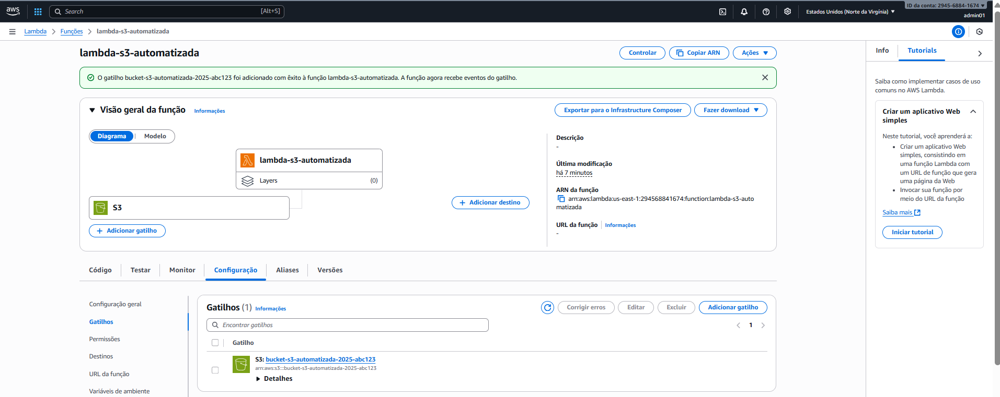

# Desafio AWS Lambda Function e S3 - Bootcamp Santander Code Girls 2025
Este laboratório tem como objetivo de consolidar seus conhecimentos em tarefas automatizadas com Lambda Function e S3. O entregável é um repositório organizado contendo anotações e insights adquiridos durante a prática, servindo como material de apoio para os seus estudos e futuras implementações.

#CodeGirls2025 #WomenInTech

## Implementando Tarefas Automatizadas com Lambda Function e S3

###Passo 1 - Crie um Bucket S3 na AWS ou tilizar um existente

###Passo 2 - Crie uma função IAM na AWS

###Passo 3 - Criar um Lambda Function

###Passo 4 - Configurar Gatilho no Lambda Function

###Passo 5 - Validar a automatização fazendo upload de arquivo e verificando logs no CloudWatch

