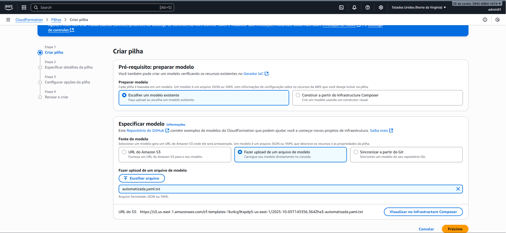

# Desafio AWS CloudFormation Automatizada - Bootcamp Santander Code Girls 2025
Este laboratório tem como objetivo implementar uma infraestrutura automatizada com AWS CloudFormation. O entregável é um repositório organizado contendo anotações e insights adquiridos durante a prática, servindo como material de apoio para os seus estudos e futuras implementações.

#CodeGirls2025 #WomenInTech

## Implementando Stack com AWS CloudFormation Automatizada

###Passo 1 - Acesse CloudFormation na AWS

###Passo 2 - Acesse a opção na aba lateral esquerda "Pilhas" e clique em "Criar pilha". Siga de acordo com as figuras abaixo. O nome será "desafioCloudFormationAutomatizada". será feito o upload do arquivo "stack-automatizada.yaml".

###Passo 3 - Configuração de Parâmetros: Nome stack: stack-automatizada; BucketName: único; CriarBucket: "sim"; Ambiente: "dev" 

###Passo 4 - Deploy e Monitoramento: Crie stack > Eventos: Monitore CREATE_IN_PROGRESS para S3/IAM (condicional ativa). Tempo: 3-5 min 

###Passo 4 - Acesse CloudFormation na AWS
Recursos e Tags: Verifique S3 (se criado) com tags; IAM Role com policy 
Outputs e Teste: Acesse BucketURL; Teste role assume via AWS CLI (opcional). Upload no S3 para validar 
Update e Deleção: Para automação, atualize parâmetro (ex.: Ambiente para "prod") – veja diff nos eventos. Delete stack para cleanup.
