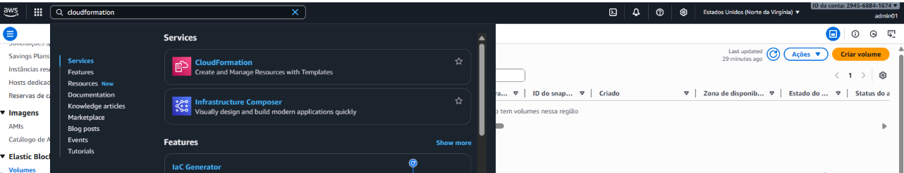
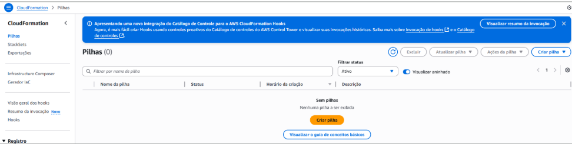

# Desafio AWS CloudFormation - Bootcamp Santander Code Girls 2025
Este laboratório tem como objetivo de implementar sua primeira Stack com AWS CloudFormation. O entregável é um repositório organizado contendo anotações e insights adquiridos durante a prática, servindo como material de apoio para os seus estudos e futuras implementações.

#CodeGirls2025 #WomenInTech

## Introdução à AWS e Conceitos Básicos
   - **Amazon S3** (Amazon Simple Storage Service) - é um serviços de armazenamento de objetos em nuvem oferecidos pela AWS. É ideal para armazenar, organizar e recuperar grandes volumes de dados de forma segura e escalável. Armazenamento de objetos na nuvem.
   - **Amazon EC2** (Amazon Elastic Compute Cloud) - é um serviço da Amazon que fornece capacidade de computação escalável na nuvem do Amazon Web Services (AWS) através de máquinas virtuais, conhecidas como instâncias. Serviço de máquinas virtuais sob demanda.
   - **Amazon EBS** (Elastic Block Store) - é um serviço para fornecer armazenamento em bloco fiável (também conhecido como volumes ou discos rígidos). Foi concebido para ser utilizado com instâncias do Amazon Elastic Compute Cloud (EC2).
   - **Amazon Lambda Function** - Serverless é um novo paradigma onde os desenvolvedores não precisam gerenciar servidores. Este conceito nos ajuda a se preocupar somente com nosso código, não precisando gerenciar instâncias. Executa código sem gerenciar servidores.
   - **Amazon AMI** (Amazon Machine Image) - é uma imagem de máquina virtual pré-configurada, que inclui as informações necessárias para iniciar uma instância, como o sistema operativo, o servidor de aplicações e as aplicações. Modelo de instância EC2 pré-configurado.\
   - ***Amazon RDS*** (Amazon Relational Database Service) - é um serviço de banco de dados relacional de fácil gerenciamento.\
   - **Amazon Glacier** - é um dos tipos de armazenamento do Amazon S3. Ele oferece armazenamento durável para qualquer tipo de formato de dados que será acessado depois de 5 dias. O objetivo é pagar menos, arquivamento de longo prazo com baixo custo.\
   - **Amazon S3 Versioning** - ontrole de versões de objetos no S3.
   - **Amazon CDN** (Amazon CloudFront) - CDN para entrega rápida de conteúdo
   - **AWS CloudFormation** - é um processo que auxilia na automação de criação de recurso na AWS por meio de templates JSON ou YAML. Podemos utilizar os templates quantas vezes quisermos e pagamos apenas pelas stacks criadas (conjunto de recursos, ex: EC2, RDS, S3, etc).

## Implementando Stack com AWS CloudFormation
###Passo 1 - Acesse CloudFormation na AWS

###Passo 2 - Acesse a opção na aba lateral esquerda "Pilhas" e clique em "Criar pilha". Siga de acordo com as figuras abaixo. O nome será desafioCloudFormation-EC2
-
-
-
-

###Passo 3 - Visualize a pilha
-

###Passo 3 - Repita o processo para desafio_CloudFormation_Apache e desafio_CloudFormation_Firewall
-

